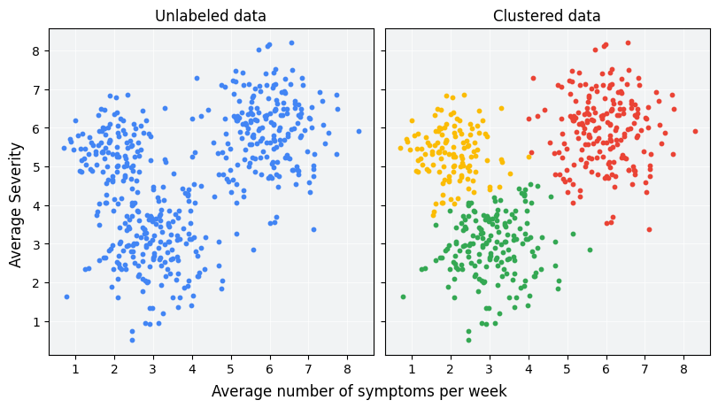

# Clustering Analysis: Discovering Patterns with K-Means, DBSCAN, and OPTICS



## 📘 Introduction
This repository contains an **unsupervised learning** project analyzing raptor bird data. The main objective is to explore patterns in the data using different clustering methods: **K-Means**, **DBSCAN**, and **OPTICS**. These algorithms help uncover hidden structures within the data based on various physical features like wing size and weight.

## 🛠️ Methodology

### K-Means
- **Centroid-based method**, groups data into *K* predefined clusters.
- Best for *spherical* clusters in clean, low-noise datasets.

### DBSCAN
- **Density-based algorithm**, identifies clusters of arbitrary shapes and handles noise effectively.
- Particularly useful when dealing with datasets containing **outliers** and varying densities.

### OPTICS
- **Extension of DBSCAN**, allows the identification of clusters with **variable densities** and provides a more detailed clustering structure visualization.

## 🖼️ Visualizations

Here are the clustering results from different algorithms:

### K-Means Clustering


### DBSCAN Clustering


### OPTICS Clustering


## 📊 Results

- **DBSCAN** and **OPTICS** performed better than **K-Means** in handling varying densities and noise in the data.
- These methods effectively managed **outliers**, while K-Means struggled due to its assumption of spherical clusters.

## 📁 Folder Structure

The repository contains the following files:

```plaintext
Clustering-Analysis/
│
├── Clustering-Analysis.Rmd       # R Markdown file for the analysis.
├── Clustering-Analysis.html      # Rendered HTML output from the R analysis.
├── images/                       # Folder containing all visualizations.
│   ├── kmeans_cluster.png        # K-Means clustering visualization.
│   ├── dbscan_cluster.png        # DBSCAN clustering visualization.
│   ├── optics_cluster.png        # OPTICS clustering visualization.
│   └── cluster_analysis_icon.png # Icon for the project.
└── README.md                     # Project description and guide.
```

## 🚀 Getting Started
To replicate this analysis locally:

## Clone this repository:

git clone https://github.com/yourusername/clustering-analysis.git
Install R packages (via RStudio):

install.packages(c("ggplot2", "cluster", "fpc", "dbscan"))
Run the Analysis: Open Clustering-Analysis.Rmd in RStudio and knit it to generate the output.

## ⚖️ Conclusion

DBSCAN and OPTICS provided superior clustering results, especially in handling irregular cluster shapes and noise.
Both methods are more robust to variations in data density than K-Means, making them ideal for complex, real-world datasets.

